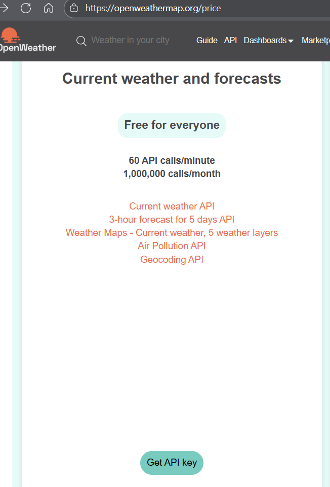
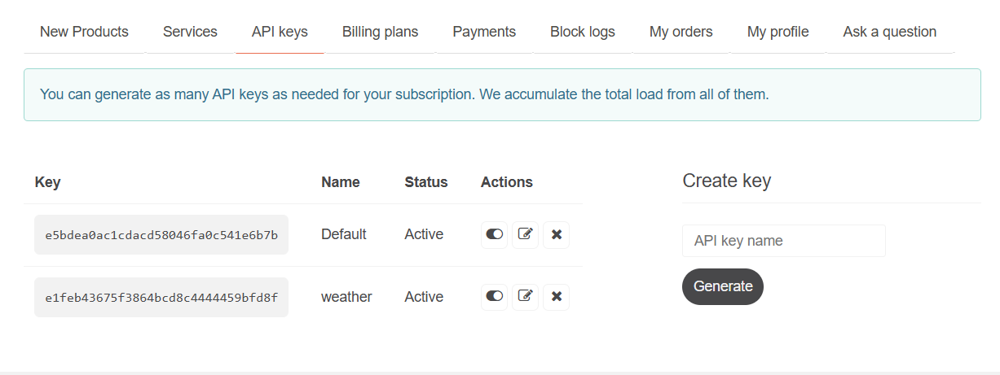
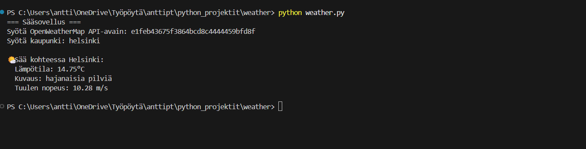

Weather-sovellus python-koodilla

Sovellus kysyy käyttäjältä API-avaimen sekä paikkakunnan jonka sää halutaan tietää. Tämän
jälkeen sovellus näyttää paikkakunnan lämpötilan, sään kuvauksen sekä tuulen nopeuden.

Sovellus koostuu kirjaston lataamisesta, hae_saa-if-else-funktiosta sekä main-pääfunktiosta.
Sovelluksen kommentoinnista löytyy tarkemmat kuvaukset toiminnallisuuksista.

Sovelluksen API-avain ladataan openweathermap.org-sivulta.

Saat lisätietoa kuvista viemällä hiiren niitten päälle.

